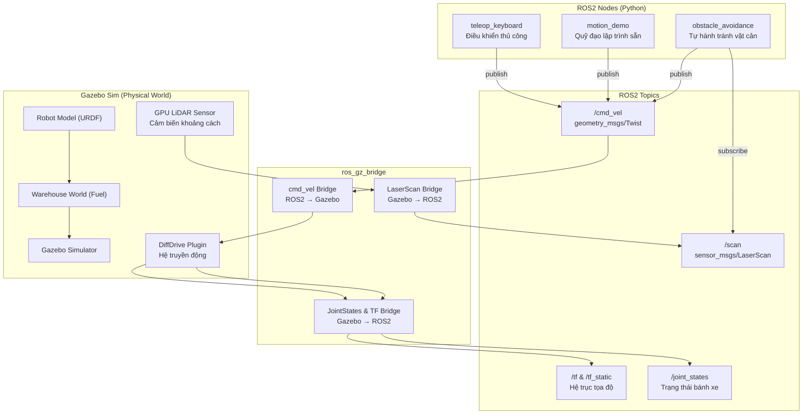

# Hướng Dẫn Học Tập: Dự án Mô Phỏng Xe Tự Hành ROS2 Jazzy + Gazebo Harmonic

Dự án này được thiết kế để học tập các khái niệm phát triển phần mềm robot chuyên nghiệp sử dụng **ROS2 Jazzy** và **Gazebo Harmonic (Gz Sim)**. Hệ thống mô phỏng một xe robot tự hành di chuyển bên trong môi trường nhà kho (Warehouse), hỗ trợ các chế độ điều khiển thủ công, chạy demo quỹ đạo và tự hành tránh vật cản thông minh.

---

## 1. Kiến Trúc Hệ Thống (System Architecture)

Để đảm bảo tính mở rộng và mô-đun hóa chuẩn công nghiệp (cho phép tích hợp thêm cảm biến, thuật toán định vị SLAM, dẫn đường Nav2 sau này), workspace được chia thành **4 packages** riêng biệt:

```
robot_car_ws/
├── src/
│   ├── robot_description/      # Định nghĩa phần cứng, hình học và cấu hình cảm biến (URDF/Xacro, meshes)
│   ├── robot_gazebo/           # Cấu hình môi trường mô phỏng (Worlds) và cầu nối truyền thông (ros_gz_bridge)
│   ├── robot_control/          # Lập trình các thuật toán điều khiển (Manual, Motion Demo, Autonomous Avoidance)
│   └── robot_bringup/          # Chứa launch file tổng hợp điều phối khởi chạy toàn bộ hệ thống
└── README.md                   # Tài liệu hướng dẫn học tập tiếng Việt (file này)
```

### Luồng Dữ Liệu và Sơ Đồ Khối (Data Flow Diagram)



---

## 2. Mô Tả Chi Tiết Các Packages

### 2.1. robot_description (Mô hình Robot)
Thư mục này chịu trách nhiệm khai báo cấu trúc cơ khí của robot bằng ngôn ngữ **Xacro** (XML Macros) thay vì viết SDF trực tiếp, giúp dễ dàng tái sử dụng và quản lý các khớp (Joints) và liên kết (Links).
- **`urdf/chassis.xacro`**: Khai báo khung xe (`base_link`), điểm quy chiếu mặt đất (`base_footprint`). Visual mesh được lấy từ mô hình gốc của NUS SEDS (`ogv.dae`). Để mô phỏng vật lý, ta khai báo hộp va chạm (`collision`) dạng box đơn giản và các thông số quán tính (`inertial`).
- **`urdf/wheels.xacro`**: Khai báo 4 bánh xe và các khớp quay (`revolute`). Tích hợp plugin truyền động **`gz-sim-diff-drive-system`** của Gazebo để nhận lệnh từ `/cmd_vel` điều khiển 4 bánh (FL/BL bên trái, FR/BR bên phải) và tính toán Odometry xuất ra TF.
- **`urdf/sensors.xacro`**: Khai báo cảm biến quét LiDAR (`gpu_lidar`) xoay 360 độ đặt trên nóc xe, xuất dữ liệu khoảng cách ra topic `/scan`.
- **`meshes/`**: Chứa file 3D `ogv.dae` và các map vật liệu PBR (Albedo, Roughness, Metalness) được tải cục bộ để RViz và Gazebo có thể render không phụ thuộc internet.

### 2.2. robot_gazebo (Thế giới Mô phỏng & Cầu nối)
- **`worlds/warehouse.sdf`**: Thiết lập thế giới nhà kho bằng cách kế thừa mô hình `warehouse` từ Gazebo Fuel của tác giả `puju`. Nạp plugin cảm biến `gz-sim-sensors-system` để vận hành LiDAR của robot trong môi trường ảo.
- **`config/bridge.yaml`**: Khai báo chi tiết ánh xạ các topic giữa Gazebo Transport và ROS2. Dữ liệu từ Gazebo truyền sang ROS2 gồm: `/scan` (Lidar), `/odom` (Odometry), `/tf` (Tọa độ), và `/joint_states` (Góc quay bánh xe). Chiều từ ROS2 sang Gazebo gồm `/cmd_vel` (Lệnh điều khiển động cơ).
- **`launch/spawn_robot.launch.py`**: Thực hiện gửi yêu cầu spawn mô hình robot vào tọa độ $(x=2.0, y=2.0, z=0.2)$ trong thế giới nhà kho (tránh va đập vào kệ hàng khi khởi động).

### 2.3. robot_control (Thuật toán Điều khiển)
Chứa các thuật toán xử lý dữ liệu và ra lệnh di chuyển cho robot dưới dạng các Node Python:
1. **`teleop_keyboard.py`**: Node cho phép người dùng bấm các phím `w`, `s`, `a`, `d`, `x` để điều khiển hướng đi trực tiếp từ terminal. Sử dụng module `termios` để bắt sự kiện bàn phím không chặn (non-blocking) và tự động khôi phục cấu hình terminal gốc khi tắt để tránh lỗi hiển thị.
2. **`motion_demo.py`**: Node thực thi các hướng di chuyển cơ bản lập trình sẵn thông qua tham số `mode` (`forward`, `backward`, `left`, `right`, `stop`).
3. **`obstacle_avoidance.py`**: Thuật toán tránh vật cản tự hành thông minh.
   - **Phân vùng quét (Sector Scanning)**: Chia góc quét Lidar 360 độ thành 3 vùng: Trước mặt (Front: $-25^\circ \to +25^\circ$), Bên trái (Left: $+25^\circ \to +80^\circ$), Bên phải (Right: $-80^\circ \to -25^\circ$).
   - **So sánh khoảng trống**: Nếu khoảng cách trước mặt ngắn hơn ngưỡng an toàn (`obstacle_threshold` mặc định $0.6$m), robot dừng lại, so sánh giá trị khoảng trống nhỏ nhất giữa bên Trái và bên Phải để rẽ vào bên rộng hơn.
   - **Thoát kẹt (Recovery)**: Nếu cả 3 phân vùng đều bị chặn (xe đi vào ngõ cụt hoặc góc kệ), robot sẽ **lùi lại** (Reverse) trong 1.5 giây, sau đó xoay góc lớn để tìm lối ra mới.

### 2.4. robot_bringup (Điều phối Khởi chạy)
- **`launch/simulation.launch.py`**: File trung tâm điều phối toàn bộ quá trình:
  1. Biên dịch file Xacro sang XML URDF.
  2. Bật node `robot_state_publisher` để xuất bản TF tĩnh của robot.
  3. Khởi động Gazebo Sim nạp thế giới nhà kho Warehouse.
  4. Tạo tiến trình `ros_gz_bridge` kết nối truyền thông.
  5. Spawn mô hình robot vào thế giới.
  6. Khởi động giao diện hiển thị đồ họa **RViz2** để giám sát tia quét LiDAR và lưới trục tọa độ.

---

## 3. Hướng Dẫn Biên Dịch và Chạy Mô Phỏng

### 3.1. Biên dịch Workspace
Trước khi chạy, hãy biên dịch toàn bộ code nguồn ROS2:

```bash
cd ~/robot_car_ws
source /opt/ros/jazzy/setup.bash
colcon build --symlink-install
source install/setup.bash
```
*(Tùy chọn `--symlink-install` giúp bạn thay đổi mã nguồn Python hoặc launch file mà không cần chạy lại colcon build)*.

### 3.2. Khởi chạy Mô phỏng Cơ sở (Môi trường & Robot)
Chạy câu lệnh sau để mở Gazebo Warehouse, Spawn robot và mở RViz2:

```bash
ros2 launch robot_bringup simulation.launch.py
```

### 3.3. Phân biệt `ros2 run` và `ros2 launch` (QUAN TRỌNG)

Đây là 2 cách chạy node ROS2 hoàn toàn khác nhau về bản chất:

| Đặc điểm | `ros2 run` | `ros2 launch` |
|---|---|---|
| **Chức năng** | Chạy **1 node duy nhất** trực tiếp | Chạy **nhiều node cùng lúc** theo kịch bản |
| **Stdin (bàn phím)** | ✅ Node nhận được input trực tiếp từ terminal | ❌ Stdin bị chặn bởi launch manager |
| **Cú pháp truyền tham số** | `--ros-args -p tên:=giá_trị` | `tên:=giá_trị` (viết tắt) |
| **Khi nào dùng** | Node cần nhập liệu từ bàn phím (teleop), hoặc chạy đơn lẻ | Khởi chạy hệ thống phức tạp nhiều node |

**Ví dụ truyền tham số:**
```bash
# Đúng cú pháp cho ros2 run:
ros2 run robot_control obstacle_avoidance --ros-args -p linear_speed:=1.5 -p angular_speed:=1.5

# Đúng cú pháp cho ros2 launch:
ros2 launch robot_control autonomous.launch.py linear_speed:=1.5 angular_speed:=1.5

# ❌ SAI - cú pháp launch KHÔNG hoạt động với run (tham số bị bỏ qua hoàn toàn):
ros2 run robot_control obstacle_avoidance linear_speed:=1.5 angular_speed:=1.5
```

> **Lưu ý quan trọng**: Node `teleop_keyboard` **bắt buộc** phải chạy bằng `ros2 run` vì nó cần đọc phím bấm trực tiếp từ terminal thông qua module `termios`. Nếu chạy qua `ros2 launch`, Stdin bị chặn → node không nhận được phím bấm → không điều khiển được.

### 3.4. Chạy Chế độ Điều khiển Thủ công (Manual Teleop)
Mở một terminal **mới**, cấu hình môi trường và chạy node Teleop:

```bash
cd ~/robot_car_ws
source install/setup.bash

# Chạy với tốc độ mặc định (Linear: 0.3 m/s, Angular: 0.5 rad/s)
ros2 run robot_control teleop_keyboard

# HOẶC tăng tốc độ di chuyển và xoay của robot (ví dụ: Linear 0.8 m/s, Angular 1.2 rad/s)
ros2 run robot_control teleop_keyboard --ros-args -p linear_speed:=0.8 -p angular_speed:=1.2
```
*Nhấp chuột vào cửa sổ terminal này và sử dụng các phím `w`, `a`, `s`, `d`, `x` để điều khiển. Nhả phím → xe tự động dừng.*

### 3.5. Chạy Chế độ Di chuyển Demo (Motion Demo Mode)
Chạy node di chuyển theo hướng cơ bản được chỉ định sẵn qua tham số `mode` (`forward`, `backward`, `left`, `right`, `stop`):

- Cách 1 — Dùng `ros2 launch` (cú pháp ngắn gọn):
  ```bash
  ros2 launch robot_control motion_demo.launch.py mode:=forward linear_speed:=0.3
  ```
- Cách 2 — Dùng `ros2 run` (cú pháp đầy đủ):
  ```bash
  ros2 run robot_control motion_demo --ros-args -p mode:=forward -p linear_speed:=0.3
  ```

### 3.6. Chạy Chế độ Tự hành Tránh vật cản (Autonomous Obstacle Avoidance)
Kích hoạt thuật toán tự hành thông minh quét đa vùng:

- Cách 1 — Dùng `ros2 launch` (cú pháp ngắn gọn):
  ```bash
  ros2 launch robot_control autonomous.launch.py obstacle_threshold:=0.6 linear_speed:=0.35 angular_speed:=0.7
  ```
- Cách 2 — Dùng `ros2 run` (cú pháp đầy đủ):
  ```bash
  ros2 run robot_control obstacle_avoidance --ros-args -p obstacle_threshold:=0.6 -p linear_speed:=0.35 -p angular_speed:=0.7
  ```
*Hãy quan sát robot tự động tìm đường đi trong nhà kho, rẽ vào hướng rộng hơn và tự động lùi khi đi vào ngõ cụt của kệ hàng.*

---

## 4. Giải Thích Các Khái Niệm ROS2 & Gazebo Quan Trọng

1. **URDF và Xacro**: URDF mô tả cấu trúc robot dưới dạng cây liên kết. Xacro cung cấp các biến (properties), phép tính toán học và macro giúp giảm thiểu trùng lặp mã nguồn (ví dụ: định nghĩa 4 bánh xe giống nhau chỉ bằng 1 dòng gọi macro).
2. **TF (Transform Library)**: Quản lý mối quan hệ tọa độ giữa các bộ phận của robot (ví dụ: tọa độ của cảm biến LiDAR so với tâm khung xe `base_link`). Nó giúp ROS2 hiểu được tia quét laser nhận về nằm ở vị trí nào so với robot.
3. **ros_gz_bridge**: Cầu nối chuyển ngữ các gói tin từ định dạng Protobuf của Gazebo sang định dạng Message của ROS2 (như `sensor_msgs/msg/LaserScan` hay `geometry_msgs/msg/Twist`).
4. **Finite State Machine (Máy trạng thái hữu hạn)**: Là kỹ thuật lập trình chia nhỏ hành vi của robot thành các trạng thái rõ ràng (FORWARD, STOP, ROTATE, REVERSE). Mỗi chu kỳ, node sẽ kiểm tra điều kiện chuyển trạng thái để xuất lệnh điều khiển phù hợp, giúp code không bị rối và hoạt động ổn định.

---

## 5. Hướng Dẫn Giải Quyết Sự Cố (Troubleshooting)

- **Lỗi: Tham số truyền vào `ros2 run` không có tác dụng (tốc độ vẫn mặc định)**
  *Nguyên nhân*: Cú pháp `ros2 run pkg node tên:=giá_trị` là **SAI**. Đây là cú pháp của `ros2 launch`.
  *Giải pháp*: Sử dụng cú pháp `ros2 run pkg node --ros-args -p tên:=giá_trị -p tên2:=giá_trị2`.
- **Lỗi: Gazebo GUI crash (OgreAxisAlignedBox assertion failed) khi click chuột vào robot hoặc sau Ctrl+C**
  *Nguyên nhân*: Đây là **bug của engine Ogre 1.9**, không phải lỗi code dự án. Ogre 1 tính sai bounding box khi click vào mesh submesh phức tạp (bánh xe) đang quay liên tục, sinh ra tọa độ NaN → assertion fail → crash. Lỗi tương tự cũng xảy ra khi robot bay khỏi bản đồ do lệnh dừng xe gửi không kịp qua DDS sau khi Ctrl+C.
  *Giải pháp đã áp dụng*:
  (1) Visual bánh xe trong Gazebo đã được chuyển từ mesh DAE submesh sang hình trụ (cylinder) đơn giản — loại bỏ hoàn toàn lỗi click.
  (2) Hàm `stop_robot()` gửi liên tiếp 10 lệnh dừng trong 1 giây để đảm bảo DDS truyền tải thành công.
  (3) Bước thời gian vật lý (`max_step_size`) giảm từ 0.02s xuống 0.004s để tăng độ ổn định mô phỏng.
- **Lỗi: Không tìm thấy thư mục meshes hoặc hiển thị lỗi màu đỏ trong Gazebo/RViz**
  *Giải pháp*: Launch file `simulation.launch.py` đã tự động thiết lập biến môi trường `GZ_SIM_RESOURCE_PATH`. Đảm bảo rằng bạn đã chạy lệnh `source install/setup.bash` trước khi chạy launch file.
- **Lỗi: Robot không di chuyển khi nhấn phím điều khiển**
  *Giải pháp*: Đảm bảo bạn đang bấm phím khi terminal điều khiển (teleop) đang được active (được chọn và hiển thị con trỏ). Nhấn `x` để dừng khẩn cấp trước khi đổi sang phím khác.
- **Lỗi: Gazebo Sim bị treo, crash đồ họa (Qt/Ogre) hoặc chạy rất chậm (FPS thấp) trên máy ảo VMware**
  *Giải pháp*: Trình điều khiển đồ họa trên máy ảo (VMware/VirtualBox) thường không hỗ trợ đầy đủ Ogre2 (động cơ đồ họa mặc định của Gazebo Harmonic). Dự án này đã được cấu hình chuyển sang sử dụng `ogre` (Ogre 1) trong file thế giới `warehouse.sdf`. Nếu gặp sự cố giật lag, hãy đảm bảo tính năng "Accelerate 3D Graphics" đã được tích hợp trong cài đặt máy ảo VMware của bạn.
